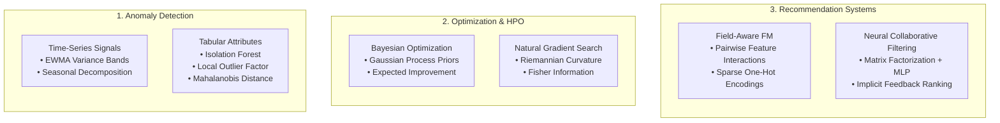

# Applied ML Systems: Classical Machine Learning Engineering Archive

[](LICENSE)
[](scripts/verify_all.sh)
[](#consolidated-engineering-modules)
[](#architectural-scope--archive-character)
[](scripts/verify_all.sh)
[](https://x.com/SupratikSarkar_)

> **A foundational applied machine learning engineering archive consolidating robust implementations in tabular/temporal anomaly detection, Bayesian hyperparameter optimization, and sparse recommendation architectures.**

---

## Architectural Scope & Archive Character

* **Classification**: `HISTORICAL APPLIED-ML ENGINEERING ARCHIVE` (Classical ML foundations).
* **Engineering Breadth & Lineage**: This repository is deliberately maintained as an engineering archive of core machine learning workflows developed across 2025. It reflects practical, production-grade statistical engineering across tabular data, time-series signals, optimization landscapes, and recommendation systems. It intentionally does not mimic generative agentic frameworks; its value lies in mathematical rigor, statistical depth, and algorithmic breadth.

```
+-------------------------------------------------------------------------------------------------+
|                                     APPLIED ML SYSTEMS ARCHIVE                                  |
|                                                                                                 |
|   +--------------------------+   +--------------------------+   +---------------------------+   |
|   |     Anomaly Detection    |   |     Optimization & HPO   |   |   Recommendation Systems  |   |
|   |  EWMA, Seasonal Bounds   |   |  Bayesian Optimization   |   |  Field-Aware FM (FFM)     |   |
|   |  Isolation Forest, LOF   |   |  Natural Gradient HPO    |   |  Neural Collaborative     |   |
|   |  Mahalanobis Distance    |   |  Convex Search Surfaces  |   |  Filtering (NCF)          |   |
|   +--------------------------+   +--------------------------+   +---------------------------+   |
+-------------------------------------------------------------------------------------------------+
```



---

## Consolidated Engineering Modules

### 1. Anomaly Detection (`legacy/anomaly-detection/`)
* **Directory**: [`legacy/anomaly-detection`](legacy/anomaly-detection/)
* **Implemented Methodologies**:
  - **Temporal & Time-Series Anomaly Detection (`time_series_anomaly.py`)**: Rolling statistical intervals, Exponentially Weighted Moving Average (EWMA) volatility tracking, and seasonal-trend decomposition for continuous sensor and telemetry feeds.
  - **Multi-Attribute Tabular Outliers (`non_time_series_anomaly.py`)**: Unsupervised anomaly scoring via Isolation Forest, Local Outlier Factor (LOF) density estimators, and covariance-adjusted Mahalanobis distance metrics.
  - **Interactive Workflow (`anomaly_runner_v2.ipynb`)**: End-to-end evaluation pipeline with threshold sweeps and confusion matrices.

### 2. Hyperparameter Optimization (`legacy/optimization-hpo/`)
* **Directory**: [`legacy/optimization-hpo`](legacy/optimization-hpo/)
* **Implemented Methodologies**:
  - **Bayesian Optimization**: Gaussian process regression surrogate models with Expected Improvement (EI) and Upper Confidence Bound (UCB) acquisition functions.
  - **Natural Gradient Search**: Second-order parameter updates accounting for probability distribution manifold curvature via Fisher Information matrix scaling.
  - **Convex Search Primitives**: Constrained gradient-based parameter tuning for smooth loss landscapes.

### 3. Recommendation Systems (`legacy/recommenders/`)
* **Directory**: [`legacy/recommenders`](legacy/recommenders/)
* **Implemented Methodologies**:
  - **Field-aware Factorization Machines (FFM)**: Captures non-linear cross-field interactions across high-cardinality categorical features for click-through rate (CTR) prediction.
  - **Neural Collaborative Filtering (NCF)**: Dual-stream deep learning architecture combining generalized matrix factorization (GMF) with multi-layer perceptron (MLP) non-linear user-item interaction layers.

---

## Capability Matrix

| System Module | Primary Algorithm | Data Modality | Key Advantage |
| :--- | :--- | :--- | :--- |
| **Temporal Anomaly** | EWMA & Rolling Bounds | Continuous Time-Series | Low latency; adaptive to non-stationary drift |
| **Tabular Outliers** | Isolation Forest / LOF | Multi-Attribute Tables | High-dimensional robustness without labels |
| **Bayesian HPO** | Gaussian Process / EI | Hyperparameter Spaces | Sample-efficient optimization of expensive models |
| **Natural Gradient** | Fisher Curvature Updates | Non-Euclidean Surfaces | Invariance to reparameterization |
| **Field-aware FM** | Factorized Pairwise Tensors| Sparse Categorical | Models field-specific interaction semantics |
| **Neural CF** | GMF + Deep MLP Stacks | Implicit User-Item Interaction | Captures latent non-linear behavioral features |

---

## Quick Start & Verification

### 1. Unified Archive Verification
The repository includes a root verification script that validates code compilation and executes test suites across all three legacy domains in an ephemeral environment:

```bash
# Clone the repository
git clone https://github.com/supratik-sarkar/applied-ml-systems.git
cd applied-ml-systems

# Run verification suite (requires Python 3.12.13)
bash scripts/verify_all.sh
```

### 2. Standalone Module Inspection
Each module can be explored independently:

```bash
# Inspect and run HPO test suite
cd legacy/optimization-hpo
pytest tests/ -q

# Inspect and run Recommender test suite
cd ../recommenders
pytest tests/ -q
```

---

## Repository Structure

```text
applied-ml-systems/
├── legacy/
│   ├── anomaly-detection/    # Statistical and unsupervised tabular/temporal anomaly models
│   ├── optimization-hpo/     # Bayesian optimization, natural gradient, and search tests
│   └── recommenders/         # Field-aware factorization machines and neural collaborative filtering
├── scripts/
│   └── verify_all.sh         # Root verification runner across all three modules
├── HISTORY.md                # Provenance records and component merge history
├── LICENSE                   # MIT License
└── LICENSES.md               # Upstream licensing documentation
```

---

## Portfolio Navigation

Part of the **Engineering & Systems Portfolio** by [Supratik Sarkar](https://github.com/supratik-sarkar):
* [applied-ml-systems](https://github.com/supratik-sarkar/applied-ml-systems) — Anomaly detection, optimization, and recommendation engines.
* [training-inference-systems](https://github.com/supratik-sarkar/training-inference-systems) — Accelerated training primitives and hardware-conscious inference.
* [agentic-ai-systems](https://github.com/supratik-sarkar/agentic-ai-systems) — Resilient agent runtimes, checkpointing, and protocol gateways.
* [multimodal-context-systems](https://github.com/supratik-sarkar/multimodal-context-systems) — Context assembly, graph retrieval, and multimodal grounding.
* [StART](https://github.com/supratik-sarkar/StART) — Evidence-native model development and institutional review platform.
